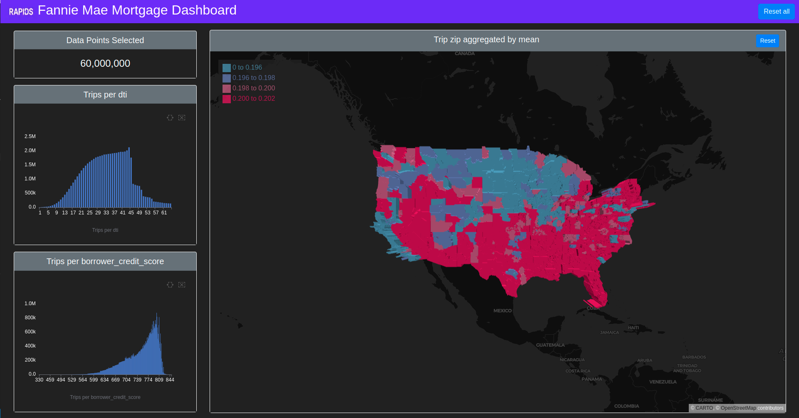

# Client-Server Visualization Demo
This demo showcases how to use cudf as a backend compute engine for a client-side deck.gl visualization over a node-express api using 2 dashboards - Uber Movement Dataset Dashboard and Fannie Mae Mortgage Dataset Dashboard.

### Uber Movement Dashboard


### Mortgage Dashboard



## Featured Dependencies
- @rapidsai/cudf
- deckgl
- apache-arrow

## Data Requirements
### Uber Movement Dataset
The data needs to be downloaded from [Uber Movements](https://movement.uber.com/explore/san_francisco/travel-times) with the following sequence of actions:
- `Click 'Download data' > Click 'All data' > Slect '2020 Quarter' > Download 'Travel Times By Date By Hour Buckets (All Days).csv'`(1.7gb)
- Save the file as `san_fran_uber.csv` in the folder `/public/data`
- If not already included, also download the `san_francisco_censustracts.geojson`(3.8mb) file into `/public/data`. NOTE: you may have to rename from a .json to .geojson extension.

### Mortgage Dataset
- The data needs to be [downloaded here](https://drive.google.com/u/0/uc?id=1KZBzbw9z-BkyuxfN4HB0u_vKbpaEjDTm&export=download&confirm=t) (4.5gb).
- Save the file as `mortgage.csv` in the folder `/public/data`

## Start
Start with the command below, then open `http://localhost:3000`
```bash
yarn start
```
